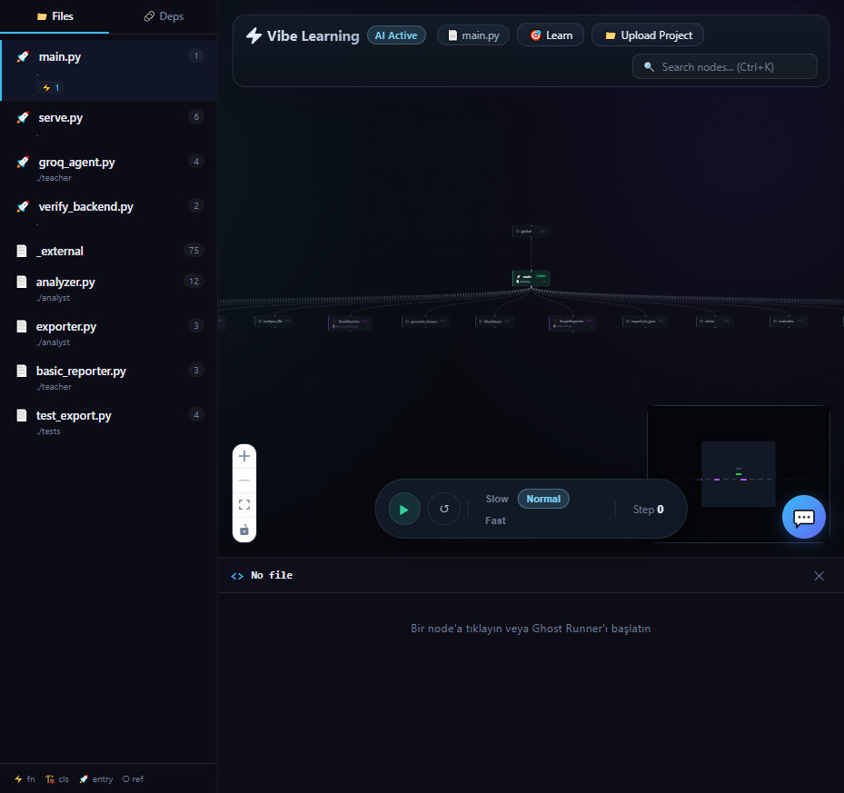
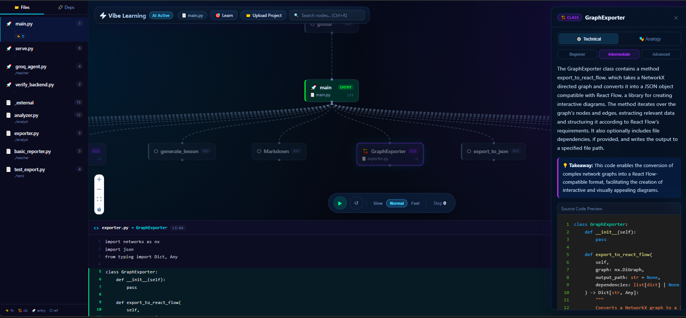
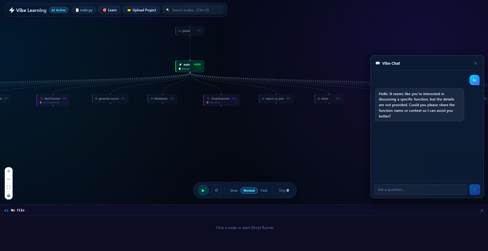
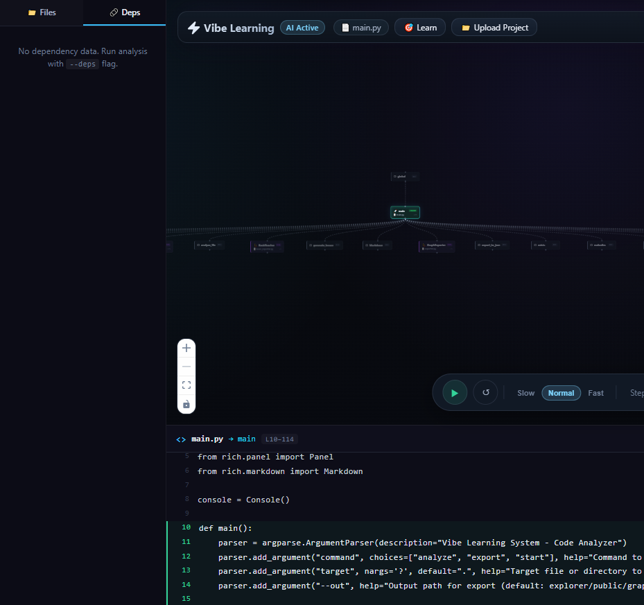

<div align="center">


# VibeGraph

**Turn any Python project into an interactive, AI-powered learning experience.**

Upload your code → explore the call graph → ask AI anything about it.

[](https://python.org)
[](https://react.dev)
[](https://fastapi.tiangolo.com)
[](https://openrouter.ai)
[](LICENSE)
[](tests/)
[](https://fly.io)
[](https://vercel.com)

</div>

---

## What is VibeGraph?

VibeGraph parses any Python codebase with AST analysis, renders it as an interactive graph, and lets you click any function or class to get an AI explanation, ask follow-up questions, or watch a "Ghost Runner" animate the execution flow in real time.

Built for people who learn by exploring — vibe coders, junior devs, or anyone dropped into an unfamiliar repo.

---

## Screenshots

<table>
  <tr>
    <td align="center" width="50%">
      
      <sub><b>Interactive call graph</b> — file sidebar, node type filtering</sub>
    </td>
    <td align="center" width="50%">
      
      <sub><b>AI explanation panel</b> — click any node, get Technical or Analogy view</sub>
    </td>
  </tr>
  <tr>
    <td align="center" width="50%">
      
      <sub><b>AI chat</b> — multi-turn conversation with full code context</sub>
    </td>
    <td align="center" width="50%">
      
      <sub><b>Dependency map</b> — imports and relationships per file</sub>
    </td>
  </tr>
</table>

---

## Features

| | Feature | Description |
|---|---------|-------------|
| 🧬 | **Interactive Call Graph** | Functions, classes, and relationships as a zoomable, pannable graph |
| 👻 | **Ghost Runner v2** | Intelligent code traversal with 5 strategies (Smart, Entry Flow, Hub Tour, By File, Random), AI narration, Explore mode, progress tracking, and run summaries |
| 🔍 | **Node Search** | Fuzzy search across all nodes with `Ctrl+K` — instantly zooms and highlights |
| 💬 | **AI Chat** | Multi-turn conversation about any node — AI holds the full source as context |
| 🎓 | **Learning Path** | AI-suggested study order: start here, then go here, for any file |
| 📝 | **Code Panel** | Source code with line numbers for every selected node |
| 💡 | **AI Explanations** | Beginner / Intermediate / Advanced levels, Technical or Analogy mode |
| 📤 | **Upload Any Project** | Drop `.py` files or a `.zip` of your whole project — graph appears instantly |

### Ghost Runner v2

The Ghost Runner has been upgraded from a simple random walk to an intelligent, AI-powered code exploration tool:

- **5 Traversal Strategies** — **Smart** (DFS from entry points with hub pause), **Entry Flow** (follow real execution paths), **Hub Tour** (visit most-connected nodes first), **By File** (explore file by file), **Random** (classic mode)
- **AI Narration** — Each step gets a brief AI-generated explanation: what the function does and how it connects to the previous one
- **Explore Mode** — Switch from Auto to Explore to guide the ghost yourself — choose which connected node to visit next
- **Progress Tracking** — Live coverage bar showing nodes visited vs total, with visited-node highlighting
- **Run Summary** — On pause, see a summary: nodes/files covered, most connected hub, unvisited entry points

---

## Quick Start

### Prerequisites

- **Python 3.10+**
- **Node.js 18+**
- **OpenRouter API key** — free at [openrouter.ai](https://openrouter.ai) (no credit card required)

### 1. Clone

```bash
git clone https://github.com/madara88645/VibeGraph.git
cd VibeGraph
```

### 2. Install dependencies

```bash
# Python backend
pip install -r requirements.txt

# React frontend
cd explorer && npm install && cd ..
```

### 3. Configure

Create a `.env` file in the project root:

```env
OPENROUTER_API_KEY=your_openrouter_api_key_here
```

### 4. Run

**Development mode** (hot reload on both sides):

```bash
# Terminal 1 — backend
python serve.py

# Terminal 2 — frontend
cd explorer && npm run dev
```

Open **[http://localhost:5173](http://localhost:5173)**

---

**Production mode** (single port, no Node needed after build):

```bash
cd explorer && npm run build && cd ..
python serve.py
```

Open **[http://localhost:8000](http://localhost:8000)**

---

### 5. Use it

**Upload your project** — click **Upload Project** in the top bar, select `.py` files or a `.zip` archive. The graph appears automatically.

**Analyze via CLI** (optional, for local files):

```bash
python main.py analyze path/to/your_project/
```

---

## Deployment

VibeGraph runs as a hybrid deployment:

| Component | Platform | URL |
|-----------|----------|-----|
| Backend API | [Fly.io](https://fly.io) | `vibegraph-api.fly.dev` |
| Frontend SPA | [Vercel](https://vercel.com) | `vibegraph.vercel.app` |

### Docker Compose (local)

```bash
docker compose up
# Open http://localhost:8000
```

### Manual Deploy

**Backend (Fly.io):**
```bash
fly deploy --config fly.toml --dockerfile Dockerfile.fly
```

**Frontend (Vercel):**
Automatic deployment on push to `main` via Vercel integration.

---

## Project Structure

```
VibeGraph/
├── app/                   # FastAPI application
│   ├── routers/           # API route handlers (upload, explain, chat, ghost, learning)
│   ├── utils/             # Security, sanitization, snippet extraction
│   ├── models.py          # Pydantic request/response models
│   ├── dependencies.py    # AI provider config (OpenRouter)
│   └── rate_limit.py      # Rate limiting configuration
├── analyst/
│   ├── analyzer.py        # AST parser → NetworkX graph
│   └── exporter.py        # NetworkX → React Flow JSON
├── teacher/
│   └── openrouter_teacher.py  # OpenRouter AI: explain / chat / ghost narration
├── explorer/              # React 19 + Vite frontend
│   └── src/components/    # GraphViewer, ChatDrawer, CodePanel, ProjectUpload, ...
├── tests/                 # 128+ pytest backend tests
├── .github/workflows/     # CI/CD (lint, security, tests, deploy)
├── fly.toml               # Fly.io deployment config
├── Dockerfile.fly         # Backend container
├── serve.py               # FastAPI server entry point
├── main.py                # CLI entry point
└── requirements.txt
```

---

## API

| Method | Endpoint | Description |
|--------|----------|-------------|
| `GET` | `/api/health` | Health check |
| `GET` | `/api/ai-config` | AI provider configuration discovery |
| `POST` | `/api/upload-project` | Upload `.py`/`.zip`, returns graph JSON |
| `POST` | `/api/snippet` | Extract source code for a node |
| `POST` | `/api/explain` | AI explanation for a node |
| `POST` | `/api/chat` | Multi-turn AI conversation |
| `POST` | `/api/chat/stream` | SSE streaming AI conversation |
| `POST` | `/api/learning-path` | AI-suggested learning order |
| `POST` | `/api/ghost-narrate` | Ghost Runner AI narration |

---

## Tech Stack

| Layer | Technology |
|-------|-----------|
| Backend | Python 3.12, FastAPI, NetworkX, `ast` stdlib |
| AI | OpenRouter — Claude Haiku 4.5, Gemini Flash, GPT-5-mini, DeepSeek, Grok |
| Frontend | React 19, React Flow, Vite 7 |
| Styling | Custom CSS — dark/light themes, glassmorphism |
| Testing | pytest (128 tests), Vitest (80 tests) |
| Deploy | Fly.io (backend), Vercel (frontend) |
| Security | Rate limiting, path traversal protection, zip bomb prevention, prompt sanitization |

---

## Tests

```bash
# Backend (128 tests)
python -m pytest tests/ -v

# Frontend (80 tests)
cd explorer && npx vitest run
```

---

## Privacy & Data Isolation

VibeGraph is designed with complete data isolation:

- **No database** — No user accounts, no persistent storage on the server
- **Ephemeral uploads** — Files are analyzed in a temporary directory and deleted immediately after processing
- **Client-side persistence** — Analysis results are stored only in your browser's `localStorage`
- **No cross-user visibility** — Each user's data is completely isolated; no one else can see your uploads
- **Automatic cleanup** — Temporary upload directories are purged after 1 hour

---

## License

GPLv3
