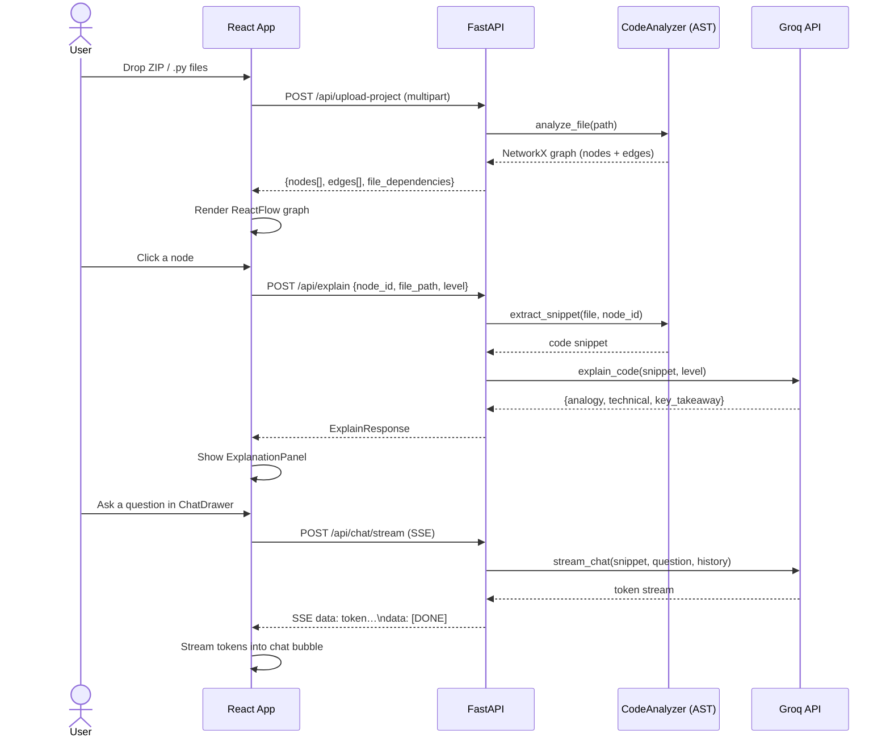

# VibeGraph Architecture

VibeGraph turns Python codebases into interactive call graphs and layers AI-powered explanations, chat, and learning paths on top.

---

## System Overview

```mermaid
graph TB
    subgraph Browser["Browser (React + ReactFlow)"]
        UI[App.jsx]
        Sidebar[FileSidebar]
        Graph[GraphViewer]
        Chat[ChatDrawer]
        Code[CodePanel]
        Learn[LearningPath]
        Upload[ProjectUpload]
        Search[SearchBar]
    end

    subgraph Backend["Backend (FastAPI)"]
        Serve[serve.py]
        subgraph Routers
            R_Upload[/api/upload-project]
            R_Explain[/api/explain]
            R_Chat[/api/chat]
            R_Stream[/api/chat/stream]
            R_Snippet[/api/snippet]
            R_Learning[/api/learning-path]
            R_Health[/api/health]
        end
        subgraph Services
            Analyzer[analyst/analyzer.py]
            Exporter[analyst/exporter.py]
            Teacher[teacher/groq_agent.py]
            Snippet[app/utils/snippet.py]
        end
    end

    subgraph External
        Groq[Groq API\nLlama 3.3-70b]
        FS[File System\ntemp uploads]
    end

    UI --> Sidebar & Graph & Chat & Code & Learn & Upload & Search
    Upload -->|POST /api/upload-project| R_Upload
    Graph -->|click node| R_Explain
    Chat -->|POST /api/chat/stream| R_Stream
    Code -->|POST /api/snippet| R_Snippet
    Learn -->|POST /api/learning-path| R_Learning

    R_Upload --> Analyzer --> Exporter
    R_Explain --> Snippet --> Teacher
    R_Chat & R_Stream --> Snippet --> Teacher
    R_Snippet --> Snippet
    R_Learning --> Analyzer --> Teacher

    Teacher -->|HTTPS| Groq
    R_Upload --> FS
    Snippet --> FS
```

---

## Data Flow: Upload → Visualize → Learn



---

## Component Map

### Backend (`app/`)

| Module | Role |
|--------|------|
| `app/__init__.py` | FastAPI factory — CORS, security headers, request-ID middleware |
| `app/routers/chat.py` | `/api/chat` and `/api/chat/stream` — multi-turn Q&A |
| `app/routers/explain.py` | `/api/explain` (AI) and `/api/snippet` (raw code) |
| `app/routers/learning.py` | `/api/learning-path` — AI study order suggestion |
| `app/routers/upload.py` | `/api/upload-project` — ZIP/file ingest, graph build |
| `app/models.py` | Pydantic request + response models; OpenAPI schema |
| `app/utils/snippet.py` | AST-based code extraction with `lru_cache` |
| `app/utils/security.py` | `is_safe_path()` — path traversal prevention |
| `app/dependencies.py` | Singleton `teacher` (GroqTeacher) dependency |

### Analysis (`analyst/`)

| Module | Role |
|--------|------|
| `analyst/analyzer.py` | Walks Python AST; builds NetworkX call graph |
| `analyst/exporter.py` | Converts graph → JSON (nodes/edges/file_dependencies); detects cycles |

### AI Layer (`teacher/`)

| Module | Role |
|--------|------|
| `teacher/groq_agent.py` | GroqTeacher — `explain_code`, `chat`, `stream_chat`, `suggest_learning_path`; LRU explain cache |

### Frontend (`explorer/src/`)

| Component / Hook | Role |
|-----------------|------|
| `App.jsx` | Root — composes all panels; manages global state via custom hooks |
| `GraphViewer.jsx` | ReactFlow canvas; PNG/SVG export buttons |
| `FileSidebar.jsx` | File list + dependency tab; "All Files" view; mobile drawer |
| `ExplanationPanel.jsx` | Floating card with AI explanation (analogy / technical / takeaway) |
| `ChatDrawer.jsx` | SSE streaming chat; fallback to non-streaming; project context injection |
| `CodePanel.jsx` | Full-file viewer with line highlighting; copy-to-clipboard; fullscreen mode |
| `SearchBar.jsx` | Fuzzy node search with keyboard navigation (Ctrl+K / /) |
| `LearningPath.jsx` | Ordered study guide from `/api/learning-path` |
| `ProjectUpload.jsx` | Drag-and-drop + click file uploader |
| `SimulationControls.jsx` | Ghost Runner play/pause/speed + guide popover |
| `hooks/useGraphData.js` | Fetch + cache graph data; cycle-edge styling |
| `hooks/useNodeInteraction.js` | Node click → explanation fetch; explanation cache |
| `hooks/useGhostRunner.js` | Animated walk through the call graph |

---

## Security Layers

1. **Path traversal** — `is_safe_path()` restricts file access to CWD and `vibegraph_upload_*` temp dirs
2. **Security headers** — `SecurityHeadersMiddleware` sets X-Frame-Options, X-Content-Type-Options, etc.
3. **CORS** — configurable via `VIBEGRAPH_CORS_ORIGINS` env var
4. **Request tracing** — `RequestIDMiddleware` adds `X-Request-ID` to every response
5. **Structured logging** — JSON log format with request IDs for prod observability

---

## Environment Variables

| Variable | Default | Description |
|----------|---------|-------------|
| `GROQ_API_KEY` | — | Required: Groq API key |
| `GROQ_MODEL` | `llama-3.3-70b-versatile` | LLM model name |
| `GROQ_TIMEOUT_SECONDS` | `30` | Request timeout for Groq calls |
| `VIBEGRAPH_CORS_ORIGINS` | `http://localhost:5173,...` | Comma-separated allowed origins |
